<div class="doc-kicker">GENERAL RAG · MCP 接入指南</div>

# 让 Agent 连接你的知识库

通过 General RAG MCP，你可以让支持 MCP 的 Agent 在获得授权后检索知识库、阅读原文，并管理本人创建的个人私有知识库文件。

<div class="doc-lead-actions">
  <a class="doc-primary-link" href="/access-keys">创建 Access Key</a>
  <a class="doc-secondary-link" href="https://makecode.forwardforever.top/" target="_blank" rel="noopener noreferrer">下载 Agent ↗</a>
</div>

<div class="doc-fact-grid">
  <div><strong>8</strong><span>个原子工具</span></div>
  <div><strong>HTTPS</strong><span>加密传输</span></div>
  <div><strong>一次</strong><span>完成配置</span></div>
</div>

> **预计用时：10 分钟。** 你需要一台 Windows 电脑、一个 General RAG 账户，以及可调用大语言模型的 API Key。

<a id="before-start"></a>
## 开始之前

MCP（Model Context Protocol）让 Agent 能以标准方式调用外部工具。接入完成后，Agent 可以根据任务自主选择关键词检索、语义检索、原文读取等工具，不需要你手动拼接接口请求。

本服务的公开连接地址是：

```text
https://starvpn.forwardforever.top:7777/mcp
```

身份认证使用 HTTP Bearer Access Key。可用知识库不受前端当前工作空间限制，包括：

- 你本人创建的知识库；
- 你加入的各个工作空间中共享的知识库；
- 他人邀请你访问的知识库；
- 公开知识库。

> 文件上传和删除是例外：它们只允许操作**当前 Access Key 用户本人创建的个人私有知识库**。

<a id="install-agent"></a>
## 第一步：安装并初始化 Agent

前往 <a href="https://makecode.forwardforever.top/" target="_blank" rel="noopener noreferrer">Agent 下载页 ↗</a> 下载 Windows 安装包。将压缩包完整解压到固定目录，不要只把 `MakeCode.exe` 单独拖出运行；程序需要同目录下的 `_internal` 文件夹。

<figure class="doc-shot">
  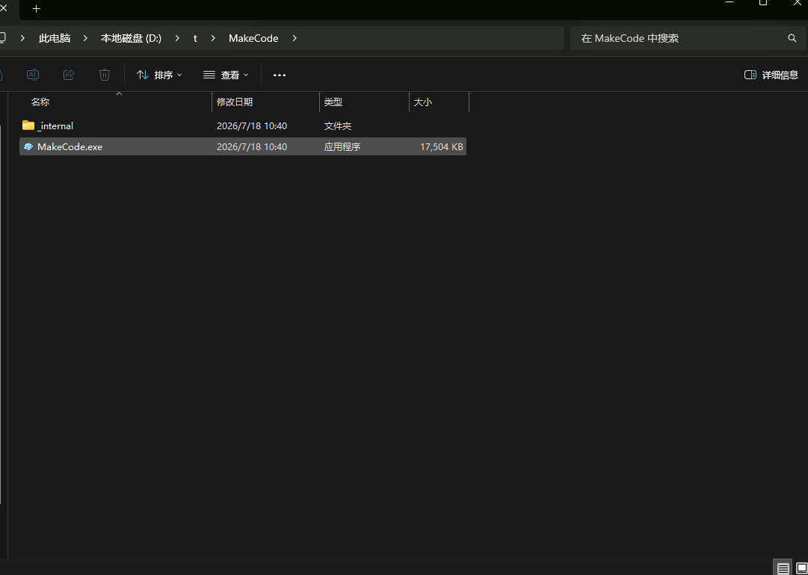
  <figcaption><strong>图 1 · 解压安装包</strong><span>确认目录中同时存在 <code>_internal</code> 和 <code>MakeCode.exe</code>。</span></figcaption>
</figure>

双击 `MakeCode.exe`。首次启动时，Agent 会要求选择工作区目录。工作区是 Agent 读取和修改文件的范围：已有项目请选择项目根目录；只是体验 MCP 时，可以选择一个专门用于 Agent 的空目录。

<figure class="doc-shot">
  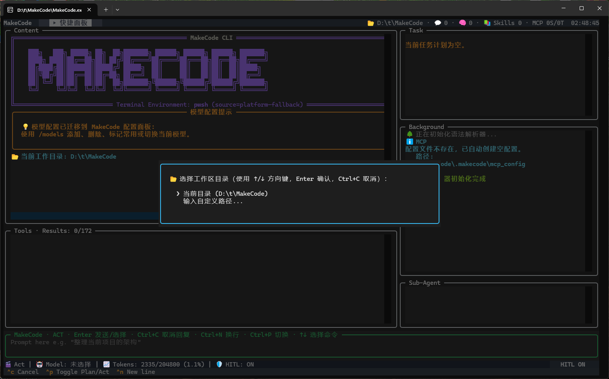
  <figcaption><strong>图 2 · 选择工作区</strong><span>使用方向键选择，按 Enter 确认；也可以选择“输入自定义路径”。</span></figcaption>
</figure>

<a id="create-kb"></a>
## 第二步：在网页端创建知识库

接入 Agent 前，可以先在 General RAG 网页端准备好要检索的资料：

1. 登录 General RAG，进入 [知识库管理页](/kb)。
2. 点击右上角的“新建知识库”，填写名称、描述和可见性后完成创建。
3. 在“我创建的知识库”中点击刚创建的知识库卡片，进入详情页并上传需要检索的文件。
4. 等待文件处理完成后，再继续配置 Access Key 和 Agent。

如果后续需要通过 MCP 上传或删除文件，目标知识库必须是**本人创建的个人私有知识库**；只做检索时，也可以使用自己有权访问的工作空间共享、受邀或公开知识库。

<figure class="doc-shot">
  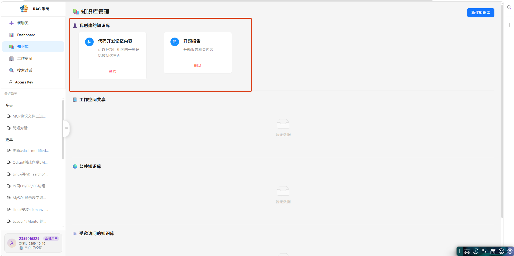
  <figcaption><strong>图 3 · 在网页端准备知识库</strong><span>点击右上角“新建知识库”；创建后从红框中的“我创建的知识库”进入详情页上传资料。</span></figcaption>
</figure>

<a id="access-key"></a>
## 第三步：创建并保存 Access Key

1. 登录 General RAG，进入 [Access Key 管理页](/access-keys)。
2. 点击右上角的“创建 Access Key”。
3. 输入便于识别的名称，例如 `我的桌面 Agent`。
4. 创建成功后，立即复制并保存在安全的位置。

<figure class="doc-shot">
  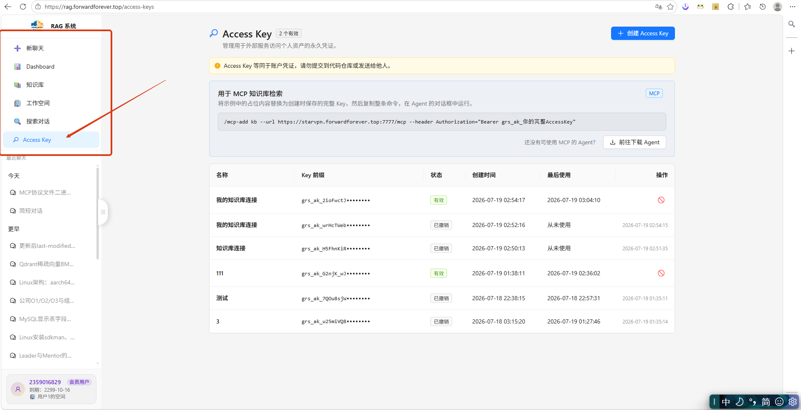
  <figcaption><strong>图 4 · 进入 Access Key 管理页</strong><span>在左侧导航栏点击“Access Key”。</span></figcaption>
</figure>

<figure class="doc-shot">
  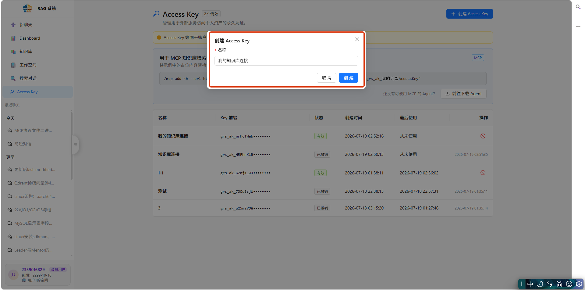
  <figcaption><strong>图 5 · 创建 Access Key</strong><span>填写易于识别的名称，之后可以据此区分不同 Agent 使用的凭证。</span></figcaption>
</figure>

<figure class="doc-shot">
  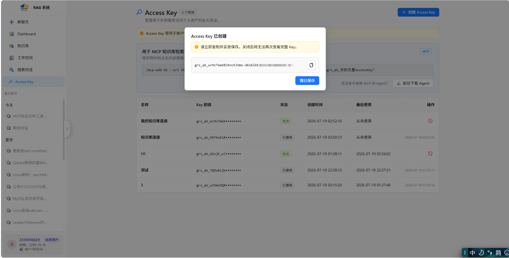
  <figcaption><strong>图 6 · 立即复制完整 Key</strong><span>完整 Key 关闭后无法再次查看。图中用于演示的 Key 已撤销。</span></figcaption>
</figure>

> **Access Key 只展示一次。** 完整 Key 等同于账户凭证。不要将它提交到代码仓库、写入公开文档、放在 URL 中、截图分享或发送给他人。若怀疑泄露，请立即在 Access Key 管理页撤销，并创建新 Key。

<a id="mcp-config"></a>
## 第四步：添加并启用 MCP 服务

在 Access Key 管理页复制配置命令，将占位内容替换为刚刚保存的完整 Access Key：

```text
/mcp-add kb --url https://starvpn.forwardforever.top:7777/mcp --header Authorization="Bearer grs_ak_你的完整AccessKey"
```

然后在 Agent 的**对话输入框**中粘贴整条命令并发送。命令开头的 `/`、`Bearer` 后的空格以及双引号都需要保留。

<figure class="doc-shot">
  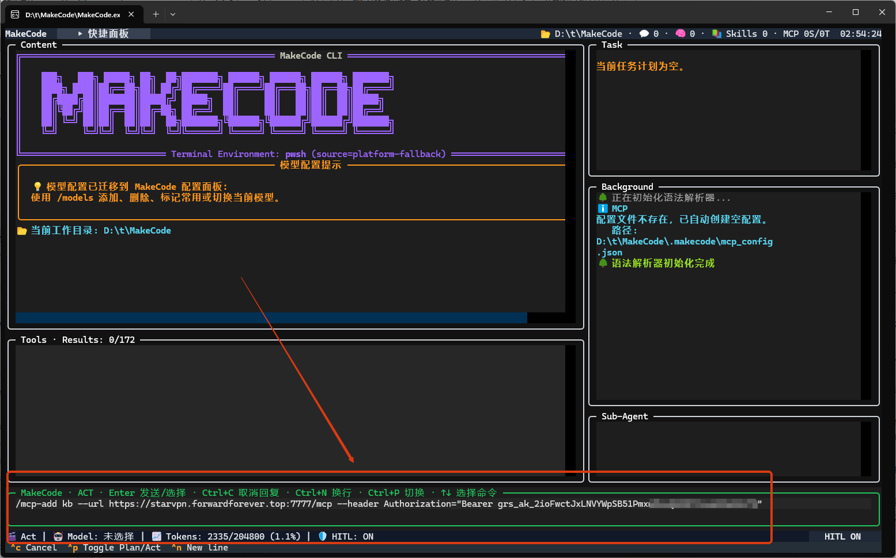
  <figcaption><strong>图 7 · 运行添加命令</strong><span>按 Enter 发送命令。截图中用于演示的 Access Key 已撤销。</span></figcaption>
</figure>

添加完成后，点击 Agent 上方快捷面板中的 **MCP配置**，进入 MCP 服务开关面板。

<figure class="doc-shot">
  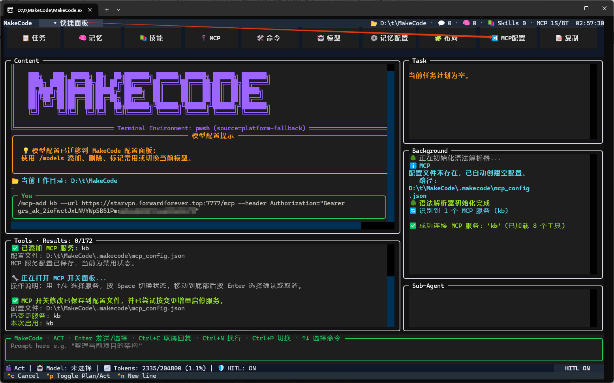
  <figcaption><strong>图 8 · 打开 MCP 配置面板</strong><span>后台显示成功连接并加载 8 个工具，表示服务地址和认证信息有效。</span></figcaption>
</figure>

使用上下方向键选中刚添加的 `kb` 服务，按 Space 切换为启用状态，再移动到“确认应用”并按 Enter。保存后，Agent 会按配置连接服务并加载工具。

<figure class="doc-shot">
  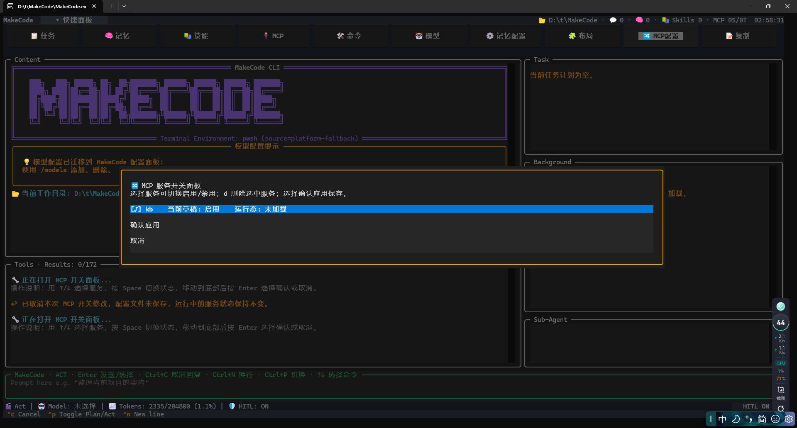
  <figcaption><strong>图 9 · 启用 kb 服务</strong><span>确认草稿状态为“启用”，然后选择“确认应用”。</span></figcaption>
</figure>

<div class="doc-callout success">
  <strong>接入成功的判断方式</strong>
  <span>Agent 后台显示成功连接 MCP 服务 <code>kb</code>，并提示已加载 8 个工具。</span>
</div>

### 其他支持 MCP 的客户端

本服务使用 **Streamable HTTP** 传输。若你的客户端支持通过界面或配置文件添加远程 MCP，请填写以下三项：

| 配置项 | 值 |
| --- | --- |
| 类型 / Transport | `Streamable HTTP` 或 `HTTP` |
| URL | `https://starvpn.forwardforever.top:7777/mcp` |
| Header | `Authorization: Bearer <你的完整 Access Key>` |

不同客户端的配置字段名称可能不同，请以对应客户端文档为准。不要把包含完整 Key 的配置文件提交到版本控制系统。

<a id="model-config"></a>
## 第五步：完成首次模型配置

首次使用 Agent 时，还需要添加一个可用的大语言模型。点击顶部快捷面板中的 **模型**，进入模型管理页面。

<figure class="doc-shot">
  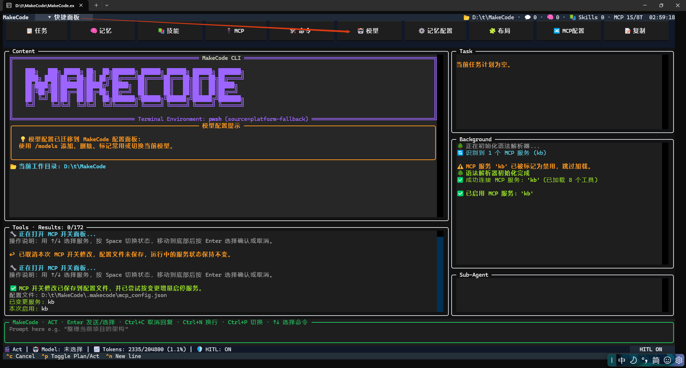
  <figcaption><strong>图 10 · 打开模型配置</strong><span>点击快捷面板中的“模型”；也可以根据界面提示使用 <code>/models</code>。</span></figcaption>
</figure>

选择“添加模型”，依次填写模型供应商提供的 Base URL、API Key 和 Model ID。下图以 DeepSeek 兼容接口以及 `deepseek-v4-flash`、`deepseek-v4-pro` 两个模型为例；请以你的供应商实际提供的信息为准。

<figure class="doc-shot">
  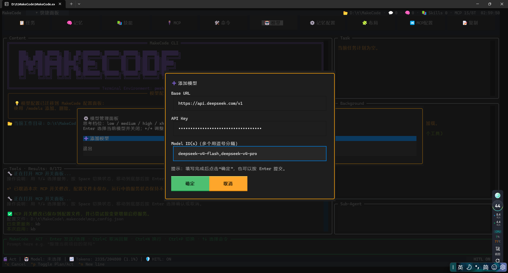
  <figcaption><strong>图 11 · 添加供应商模型</strong><span>API Key 输入框会以密文显示；多个 Model ID 使用英文逗号分隔。</span></figcaption>
</figure>

添加完成后，使用上下方向键选择模型，按 Enter 将其设为当前模型；使用左右方向键调节思考强度。思考强度越高，复杂任务通常会使用更多时间和 Token。

<figure class="doc-shot">
  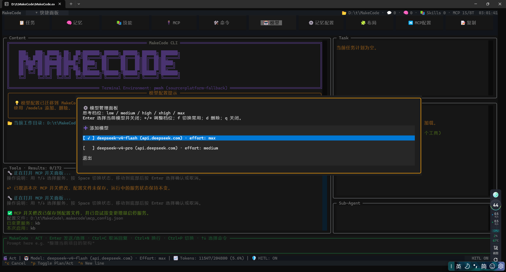
  <figcaption><strong>图 12 · 选择模型和思考强度</strong><span>截图选择了 <code>deepseek-v4-flash</code>，并将 effort 调整为 max。</span></figcaption>
</figure>

<a id="first-search"></a>
## 第六步：开始知识库检索

配置完成后，直接用自然语言告诉 Agent 你的目标。Agent 会先识别可访问的知识库，再组合检索和原文阅读工具完成任务。

```text
列出我有哪些知识库，每个知识库中有哪些文件。
```

<figure class="doc-shot">
  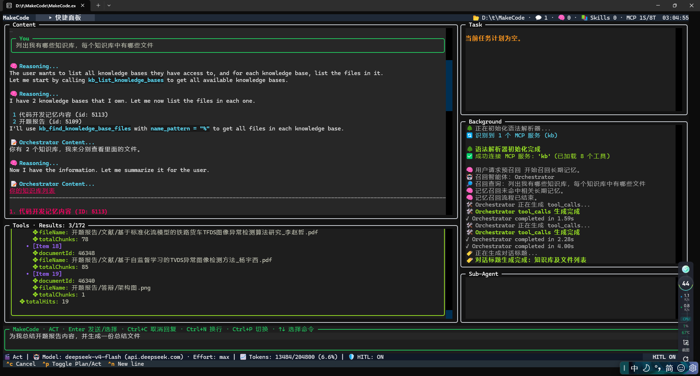
  <figcaption><strong>图 13 · 最终效果</strong><span>Agent 已连接 kb 服务，并通过 MCP 工具获取知识库和文件列表。</span></figcaption>
</figure>

### 更多提问示例

```text
请查看我可访问的知识库，找到与“退款审批流程”相关的资料，
根据原文总结申请条件、审批节点和常见驳回原因，并注明依据的文件名。
```

```text
在产品运维知识库中精确查找错误码 E1027，
读取命中位置前后的完整上下文，并给出排查步骤。
```

```text
先找出安全规范知识库中的所有 Markdown 文件，
只在这些文件内搜索“密钥轮换”，然后比较各文件的要求。
```

<a id="tools"></a>
## 8 个可用工具

Agent 通常会自动选择工具。理解每个工具的用途，可以帮助你写出更清晰的任务要求。

| 工具 | 用途 | 适合场景 |
| --- | --- | --- |
| `list_knowledge_bases` | 分类列出当前用户可访问的知识库 | 开始任务、确认知识库 ID |
| `search_knowledge_base_by_keywords` | 按明确关键词、错误码或原文短语精确检索 | 已知术语、配置项、编号；支持限定 `documentId` |
| `search_knowledge_base_by_semantics` | 使用多种问题表述进行语义召回、去重和相关性过滤 | 概念性问题、同义表达、综合问答 |
| `find_knowledge_base_files` | 按文件名模式查找文件 | 找某类文件，例如 `%.md`、`%规范%` |
| `read_knowledge_base_chunks` | 按 `documentId` 连续读取指定原文片段 | 获取精确原文；单次最多 20 个 Chunk |
| `expand_knowledge_base_context` | 围绕命中片段向前后扩展上下文 | 补全被切分的段落；前后窗口各 0–9 个 Chunk |
| `upload_private_knowledge_base_file` | 上传 UTF-8 文本内容 | 仅限本人创建的个人私有知识库 |
| `delete_private_knowledge_base_file` | 按 `documentId` 删除文件 | 仅限本人创建的个人私有知识库 |

### 关键词检索还是语义检索？

<div class="doc-compare">
  <div>
    <span class="compare-label">精确命中</span>
    <h3>关键词检索</h3>
    <p>适合错误码、函数名、合同编号、产品型号和原文短语。多个关键词可以使用 AND 或 OR 组合。</p>
  </div>
  <div>
    <span class="compare-label">理解意图</span>
    <h3>语义检索</h3>
    <p>适合“这件事应该怎么办”一类问题。Agent 可以提供 1–10 条不同表述，并通过相关性阈值过滤结果。</p>
  </div>
</div>

<a id="file-management"></a>
## 管理个人私有知识库文件

### 上传文本文件

你可以让 Agent 生成或整理文本，并直接上传到本人创建的个人私有知识库：

```text
请列出我本人创建的个人私有知识库。
把下面这份会议纪要上传到“项目档案”，文件名使用 meetings/2026-07-19.md。
上传前先向我确认目标知识库和文件名。
```

上传时需要注意：

- `file_name` 必须是相对路径，例如 `docs/说明.md`；
- 不允许绝对路径，也不允许 `.`、`..` 或空路径段；
- `content` 是 UTF-8 文本内容；
- 去重范围是同一知识库内的文件内容：内容完全相同会被拒绝；
- 同名但内容不同的文件允许上传。

### 删除文件

```text
请在“项目档案”知识库中查找文件名为 meetings/2026-07-19.md 的文档，
告诉我它的 documentId，得到我确认后再删除。
```

> **删除属于高风险操作。** 建议明确要求 Agent 在删除前复述知识库、文件名和 `documentId`，并等待你的确认。删除完成后无法通过 MCP 恢复。

<a id="troubleshooting"></a>
## 常见问题排查

### 提示未授权、401 或 Access Key 无效

- 确认 Header 格式是 `Authorization: Bearer grs_ak_...`；
- 确认 `Bearer` 与 Key 之间有一个空格；
- 确认使用的是完整 Key，而不是管理页中显示的 Key 前缀；
- 检查该 Key 是否已被撤销；
- 若 Key 已丢失，旧 Key 无法再次查看，请创建一个新 Key。

### Agent 找不到目标知识库

先让 Agent 调用知识库列表工具，并核对当前 Access Key 所属账户是否拥有访问权限。工作空间知识库权限取决于该账户在各工作空间中的成员关系，而不是网页当前选中的工作空间。

### 上传或删除提示“仅支持操作本人创建的个人私有知识库”

共享、受邀请、公开知识库以及他人创建的知识库均不能通过 MCP 上传或删除文件。请改用本人创建且可见性为“私有”的知识库。

### 搜索结果不够准确

- 明确错误码、专有名词时，要求使用关键词检索；
- 问法较抽象时，要求使用语义检索，并提供多个不同表述；
- 找到相关片段后，要求 Agent 扩展上下文或连续读取原文；
- 已知目标文件时，先查找文件获得 `documentId`，再限定检索范围。

### 配置后无法连接

确认 URL 完整包含 `/mcp`：

```text
https://starvpn.forwardforever.top:7777/mcp
```

同时检查客户端是否支持远程 Streamable HTTP MCP，以及网络代理或安全软件是否拦截 HTTPS 长连接。

<a id="security"></a>
## 安全建议

1. 为不同客户端创建不同名称的 Access Key，便于识别和单独撤销。
2. 不要在聊天、日志、截图、URL 或代码仓库中暴露完整 Key。
3. 定期查看“最后使用时间”，发现异常后立即撤销。
4. 不再使用某个客户端时，及时撤销对应 Key。
5. 在执行上传、删除等会修改数据的操作前，要求 Agent 先展示目标并等待确认。
6. 工具调用会记录必要的审计信息，但不会记录完整 Access Key、检索到的 Chunk 正文或上传文件内容。

<div class="doc-finish">
  <span>准备好了吗？</span>
  <h2>连接知识，让 Agent 从“回答”走向“查证”。</h2>
  <a href="/access-keys">创建 Access Key →</a>
</div>
